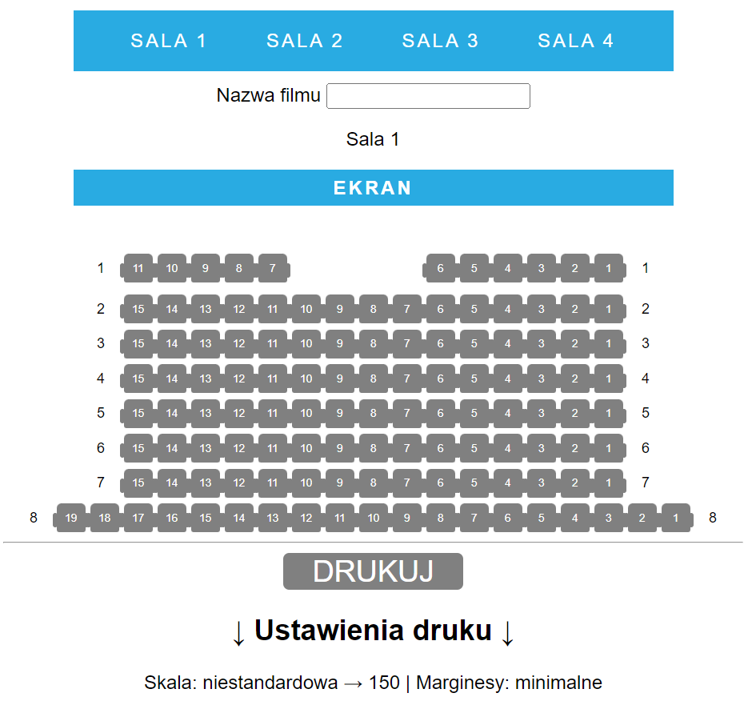
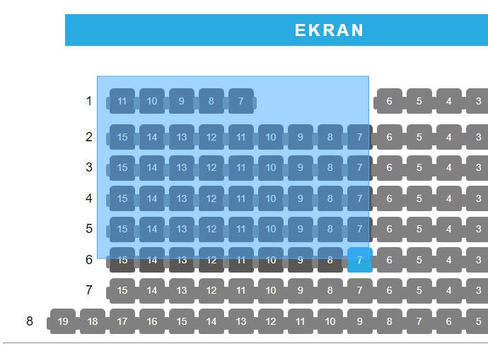
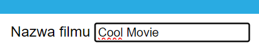
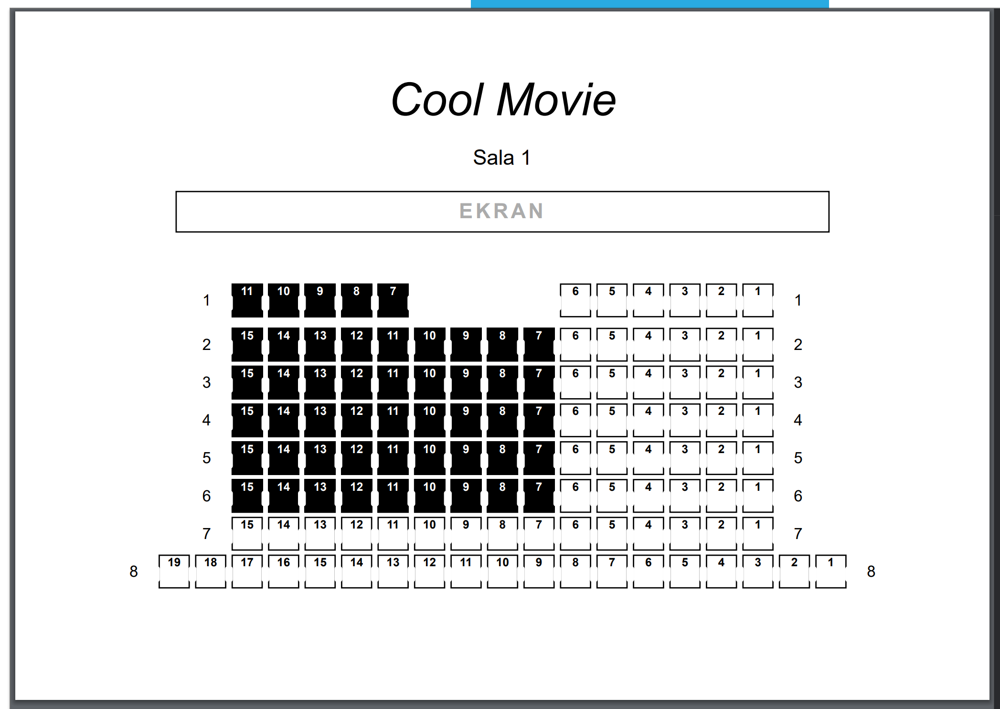

<h1 align="center">SaleKinoweDoWydruku</h1>

<p align="center">
A simple web tool for selecting cinema seats and printing the seating layout.
</p>

<p align="center">

</p>

<hr>

## Description

SaleKinoweDoWydruku is a lightweight web page designed to quickly prepare printable cinema seating layouts.  
Users can select seats directly on the seating map, provide the movie title and generate a clean print-ready view of the layout.

<hr>

## Selecting seats

Seats can be selected directly on the seating layout.  
Multiple seats can be marked before printing, making it easy to prepare seating arrangements.



<hr>

## Movie title

The page also allows entering the movie title.  
The provided title appears on the printed layout, making it easier to identify the screening.



<hr>

## Print preview

After selecting seats and entering the movie title, the layout can be printed using the button below the seating area.  
The page is styled specifically for browser printing to produce a clean and readable seating layout.



<hr>

## Usage

Open the page in a browser, select the desired seats, enter the movie title and press the print button.  
Your browser's print dialog will open, allowing the layout to be printed.

<hr>

## Project structure

```
SaleKinoweDoWydruku
│
├─ docs                     # screenshots used in the README
│   ├─ image1.png
│   ├─ image2.png
│   ├─ image3.png
│   └─ image4.png
│
├─ JS                       # client-side logic
│   ├─ druk.js
│   └─ Operations.js
│
├─ PHP                      # cinema room layouts
│   ├─ sala1.php
│   ├─ sala2.php
│   ├─ sala3.php
│   └─ sala4.php
│
├─ node_modules             # npm dependencies
│
├─ style.css                # main stylesheet
├─ package.json             # project configuration
├─ package-lock.json        # dependency lock file
└─ README.md
```
